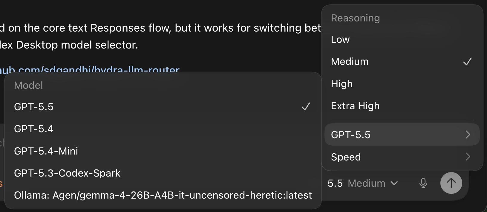

# Hydra LLM Router

Hydra lets Codex Desktop use one model selector for both OpenAI cloud models and local Ollama models.



The important design choice is that Hydra does not add a new Codex model provider. It keeps Codex Desktop in its built-in OpenAI provider bucket and only changes:

- `model_catalog_json` to a merged Hydra catalog
- `openai_base_url` to `http://127.0.0.1:3847`

Keeping the provider identity as OpenAI preserves existing Codex Desktop chats and OAuth behavior.

## Commands

```sh
npm test
node src/cli.js refresh
node src/cli.js install
node src/cli.js serve
node src/cli.js stop
node src/cli.js restore
node src/cli.js status
```

`install` backs up `~/.codex/config.toml`, refreshes the merged catalog, and points Codex Desktop at Hydra. `restore` writes the saved backup back.

After testing with debug mode, restart without debug logging:

```sh
node src/cli.js stop
node src/cli.js serve
```

## Model Routing

Cloud models keep their Codex catalog slugs, for example:

```text
gpt-5.5
```

Ollama models are exposed with an `ollama/` prefix, for example:

```text
ollama/llama3.2:latest
```

The prefix avoids name collisions and lets Hydra choose the correct upstream deterministically.

## Cloud Auth

Codex Desktop uses ChatGPT OAuth/session auth, not a public OpenAI API key. For normal Desktop use, Hydra forwards cloud model requests to:

```text
https://chatgpt.com/backend-api/codex
```

Do not forward Desktop OAuth tokens to `https://api.openai.com/v1`; that endpoint expects API keys and returns `401`.

To explicitly use public OpenAI API-key forwarding instead:

```sh
HYDRA_OPENAI_BASE_URL=https://api.openai.com/v1
OPENAI_API_KEY=sk-...
node src/cli.js serve
```

## Configuration

Useful environment variables:

```sh
HYDRA_PORT=3847
OLLAMA_BASE_URL=http://127.0.0.1:11434
HYDRA_OPENAI_BASE_URL=https://chatgpt.com/backend-api/codex
OPENAI_API_KEY=...
HYDRA_OLLAMA_CONTEXT_WINDOW=32768
```

Generated files live under:

```text
~/.codex/hydra/
```

Key files:

- `hydra-models.json`: merged Codex + Ollama model catalog
- `routes.json`: model slug to upstream route table
- `settings.json`: last generated router settings
- `config.backup.toml`: saved Codex config for restore
- `hydra.pid`: running server pid
- `hydra.log`: debug log when `--debug-auth` is enabled

## Debugging

Run with redacted request diagnostics:

```sh
node src/cli.js serve --debug-auth
```

Stop it from another terminal:

```sh
node src/cli.js stop
```

Debug logs are written to:

```text
~/.codex/hydra/hydra.log
```

Prompt text is not logged. Request bodies are summarized by shape, model, and key names. Sensitive headers are redacted, but header names and value lengths are retained for diagnostics.

Codex Desktop currently sends Responses request bodies compressed with `content-encoding: zstd`. Hydra decodes compressed request bodies before parsing JSON.

## Current Scope

Hydra supports the core text Responses flow for:

- OpenAI cloud models through Codex Desktop's ChatGPT-login backend
- Ollama local chat models through `/api/chat`

The WebSocket prewarm attempt from Codex Desktop is logged and rejected with `426`; the app falls back to `POST /responses`, which is the working path.
