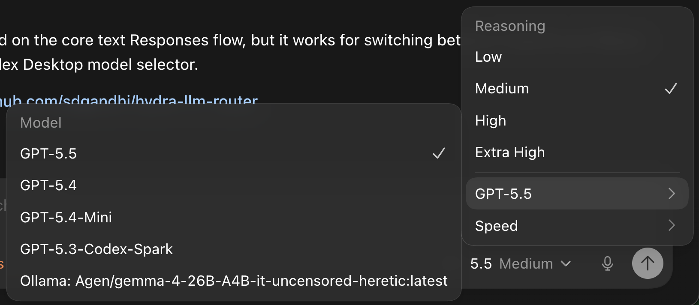

# Hydra LLM Router

Hydra lets Codex Desktop use one model selector for OpenAI cloud models plus local Ollama, LM Studio, and OMLX models.



The important design choice is that Hydra does not add a new Codex model provider. It keeps Codex Desktop in its built-in OpenAI provider bucket and only changes:

- `model_catalog_json` to a merged Hydra catalog
- `openai_base_url` to `http://127.0.0.1:3847`

Keeping the provider identity as OpenAI preserves existing Codex Desktop chats and OAuth behavior.

## Commands

```sh
npm test
npm run dmg:dev
node src/cli.js refresh
node src/cli.js install
node src/cli.js serve
node src/cli.js stop
node src/cli.js restore
node src/cli.js status
node src/cli.js models
node src/cli.js route --model hydra/money-saver --input "Summarize this request"
node src/cli.js prompt --model hydra/money-saver --input "Reply with hello"
node src/cli.js session --model hydra/money-saver --input "Remember ORCHID" --input "What did I say?"
```

Hydra reads persistent settings from `~/.hydra/config.toml`. Use `--config <path>` with any command for an isolated development, test, or one-off profile. Command flags override the selected TOML file for that invocation.

`install` backs up `~/.codex/config.toml`, refreshes the merged catalog, and points Codex Desktop at Hydra. `restore` writes the saved backup back.

## macOS App

Hydra is distributed as a signed macOS DMG. Open the DMG, drag `Hydra.app` to Applications, and launch it. The app runs entirely in the menu bar; it does not open a Dock window.

Hydra creates its bundled Money Saver synthetic model on first launch without modifying Codex. Use `Install Hydra in Codex` to back up the current Codex configuration, refresh the model catalog, and route Codex through Hydra. Use `Restore Codex Config` to restore that backup without quitting. `Open Hydra Config` asks which installed application should open the file. `Quit Hydra & Restore Codex` restores the backup and stops the router.

Development builds bundle the current Node runtime, use the current package version without changing it, and are ad-hoc signed. Redacted debug logging is enabled in both development and release builds:

```sh
npm ci
npm run dmg:dev
```

The output is written to `dist/Hydra-<version>-dev-<architecture>.dmg`. Because the bundled Node executable is architecture-specific, build once on each target architecture you distribute.

Release builds increment the patch version in `package.json` and `package-lock.json` before creating the app and DMG. By default they are ad-hoc signed and cannot be notarized:

```sh
npm run dmg:release
```

To produce a distributable Developer ID-signed release instead:

```sh
HYDRA_SIGNING_IDENTITY="Developer ID Application: Your Name (TEAMID)" npm run dmg:release
```

Set `HYDRA_NOTARY_PROFILE` to an `xcrun notarytool` keychain profile to notarize and staple the release DMG as part of the same build:

```sh
HYDRA_SIGNING_IDENTITY="Developer ID Application: Your Name (TEAMID)" \
HYDRA_NOTARY_PROFILE="hydra-notary" \
npm run dmg:release
```

Never use `dmg:release` for local iteration: every invocation intentionally changes the tracked version, even if a later signing or packaging step fails.

For terminal-only use, `serve` can still run without a menu bar:

```sh
node src/cli.js serve --no-menubar
```

The menu bar and `models` command both show the detected catalog entries Hydra has written. Install, restore, refresh, and config actions appear directly below the Codex routing status. The nested `Synthetic Models` view shows each model's selector, candidates, fallback, routing scope, retry settings, and last in-memory target. Click a selector row to reveal its module in Finder. Its `Refresh` action reloads synthetic definitions and the catalog and clears routing locks; `Open Hydra Config` opens the unified TOML file. Local providers are queried during `refresh` or `install`; a provider that is offline or advertises no chat models contributes no direct catalog entries.

## Model Routing

Cloud models keep their Codex catalog slugs, for example:

```text
gpt-5.5
```

Ollama models are exposed with an `ollama/` prefix, for example:

```text
ollama/llama3.2:latest
```

LM Studio models are exposed with an `lmstudio/` prefix, for example:

```text
lmstudio/qwen/qwen3.6-27b
```

OMLX models are exposed with an `omlx/` prefix, for example:

```text
omlx/gemma-4-12B-it-MLX-8bit
```

The prefix avoids name collisions and lets Hydra choose the correct upstream deterministically.

## Synthetic Models

Synthetic models are stable `hydra/` catalog entries whose JavaScript selector chooses one direct OpenAI, Ollama, LM Studio, or OMLX model for a request. The selector returns only the target model slug; Hydra then performs exactly one user-visible generation through the existing provider adapter. Synthetic models cannot select other synthetic models.

Choose `Synthetic Models` → `New…` in the menu bar to create a prompt-routed model. The form lists every currently available direct server and local model for the candidate allowlist, fallback, and configurable selector model. Candidates receive routing numbers in the order their checkboxes are selected; a fallback outside that list receives the next number. The editable selector prompt is prefilled with a practical complexity rubric, while Hydra appends the authoritative number-to-slug mapping itself.

Generated selectors send only the latest user message plus the approximate non-system prompt token count and the numbers of previous user and agent messages. They do not send system/developer prompt text, history content, tool calls/results, capability data, provider state, or machine telemetry. Selector inference uses thinking disabled, `temperature = 0`, and a strict JSON Schema whose integer selection is constrained to the displayed routing numbers. Hydra validates the structured result and maps it to a slug after inference. Hydra always logs the exact selector-model response, deterministic settings, compact context counts, and score mapping for debugging—even when general debug logging is disabled; generation-model output and prompt text remain excluded from logs.

The form also configures per-user-turn or per-conversation scope, selector timeout in seconds (`0` disables it), and generation retry count and delay. Save validates the complete form and rejects duplicate names, generates a selector from Hydra's bundled prompt-router template under `~/.hydra/selectors/`, appends its definition to `config.toml`, and refreshes the running router.

`install` creates the bundled `hydra/money-saver` preset without overwriting an existing config or selector. Money Saver calls LM Studio's `liquid/lfm2.5-1.2b` with thinking disabled to classify the task using a strict score:

| Score | Generation model |
| --- | --- |
| 1 | `lmstudio/liquid/lfm2.5-1.2b` |
| 2 | `lmstudio/google/gemma-4-26b-a4b-qat` |
| 3 | `gpt-5.6-sol` |

Its concrete fallback is `gpt-5.6-sol`.

Synthetic definitions live alongside Hydra's router settings in `~/.hydra/config.toml`:

```toml
[synthetic_models.money-saver]
display_name = "Hydra: Money Saver"
description = "Routes requests by estimated task complexity."
selector = "selectors/money-saver.js"
candidates = [
  "lmstudio/liquid/lfm2.5-1.2b",
  "lmstudio/google/gemma-4-26b-a4b-qat",
]
fallback_model = "gpt-5.6-sol"
routing_scope = "user_turn"
sticky_tool_continuations = true
selector_timeout_ms = 0
retry_count = 2
retry_delay_ms = 1000
```

Selector paths resolve relative to this TOML file. The module must default-export a synchronous or asynchronous function:

```js
export default async function select(context) {
  return "gpt-5.6-sol";
}
```

The context contains the raw decoded Responses request, separated system/developer/history/latest-user/tool-call/tool-result data, conservative token and file/image/tool counts, requested reasoning effort, candidate capabilities and context windows, live provider/model status, machine telemetry, request source, and a cancellation signal. The selector must return one direct slug from its candidate allowlist or the concrete fallback, which is implicitly allowlisted. Any other value is a selector error.

For reproducible local-selector evaluation, see the [30-case synthetic selector benchmark](experiments/synthetic-selector-benchmark/README.md). It compares Liquid LFM2.5 1.2B and Gemma 4 26B A4B across context trimming, rubric/few-shot prompts, sampling settings, and JSON-Schema-constrained outputs without using the Desktop Hydra listener.

> **Security warning:** selector modules are trusted, unsandboxed JavaScript. They have the Hydra process's access to files, environment variables, credentials, network, dependencies, and subprocesses. A worker thread keeps selector work off the request loop; it is not a security boundary. Only install selector code you trust.

`routing_scope = "user_turn"` evaluates the selector for each user turn. With `sticky_tool_continuations = true`, tool-result continuations reuse that turn's exact target and effective reasoning effort. `routing_scope = "conversation"` instead locks requests sharing a `session-id` to the first successful target. Locks are memory-only and clear on restart or refresh.

Responses server state takes precedence over both routing scopes. Hydra records response and conversation ownership from successful OpenAI requests. When a synthetic request later supplies a known `previous_response_id` or `conversation`, Hydra pins that entire `session-id` to the state-owning OpenAI route; later requests in the session bypass selection even if they omit the state reference and send complete history. A pinned stateful session never falls back to another model. Unknown state references, state references without a `session-id`, and state references on local routes are rejected with `400` rather than risk routing state to the wrong upstream. Ownership records and stateful session pins are memory-only and clear on restart or refresh.

Hydra validates target capability and actual context fit, retries only the selected target, and then uses the configured fallback for selector errors or failures before response output. It never chooses another candidate on its own. Once response bytes are emitted, Hydra never changes models.

Synthetic model and selector edits can be applied with:

```sh
node src/cli.js refresh
```

Invalid TOML prevents startup/refresh. A missing selector omits only that synthetic model. Temporarily unavailable candidates remain configured so the selector can see their live status and normal retry/fallback behavior applies.

### CLI routing and end-to-end testing

`route` invokes the running server and performs a real selector decision without final generation:

```sh
node src/cli.js route \
  --model hydra/money-saver \
  --input "Analyze this TypeScript race condition" \
  --reasoning medium
```

`prompt` runs one complete authenticated Codex CLI generation through Hydra in a read-only, no-approval execution:

```sh
node src/cli.js prompt \
  --model hydra/money-saver \
  --input "Reply exactly HYDRA_OK" \
  --reasoning low
```

`session` starts or resumes a multi-turn Codex CLI session. Repeat `--input` for scripted turns, pass `--session-id` to resume a reported session later, or omit inputs to use the interactive prompt:

```sh
node src/cli.js session \
  --model hydra/money-saver \
  --input "Remember ORCHID-731" \
  --input "What codeword did I give you?" \
  --reasoning low
```

All three commands also support text `--file` inputs and `--image` attachments. `--input`, `--file`, and `--image` are repeatable; prompt text can also come from standard input.

## Responses Reasoning and Streaming

For LM Studio and OMLX routes, Hydra normalizes `reasoning.effort`, `reasoning_effort`, and `reasoning_level` from Responses requests. Codex Desktop's visible `low` preset and an explicit `none` are translated to `chat_template_kwargs.enable_thinking: false` and `reasoning_effort: "none"`. Other efforts enable the chat-template thinking mode and are forwarded only when the route advertises thinking support. If reasoning is omitted, or another effort targets a route without thinking capability, Hydra preserves the route's existing behavior without enabling thinking.

For local-model turns, Hydra removes `request_user_input` unless Codex explicitly marks the turn as Plan mode, because Codex only executes that tool in Plan mode. Treating Plan as an opt-in also protects CLI and older Desktop requests that omit collaboration-mode metadata.

Hydra exposes hosted `web_search` and `tool_search` declarations to local providers only when their Hydra executors are ready. Hydra executes those calls inside a bounded local tool loop, returns the results to the model, and sends only the final answer back to Desktop.

Desktop-owned function tools such as `exec_command` remain delegated to Codex Desktop so its workspace sandbox and approval policy stay authoritative. Responses custom tools such as `apply_patch` are wrapped as local JSON functions and translated back to `custom_tool_call` events when selected.

Hydra strips leaked channel-control markers such as `<|channel>thought ... <channel|>` from both streaming and non-streaming local-model output. The streaming filter buffers partial markers so control tokens split across upstream chunks are not exposed to Codex Desktop.

With `stream: true`, Hydra sends streaming LM Studio and OMLX chat-completions requests and translates chunks to Responses SSE as they arrive; it does not wait for the complete local response. Text is emitted as `response.output_text.delta`. Reasoning-summary events are emitted only when thinking was explicitly enabled, and an explicit `none` never emits them. Successful streams end with `response.completed` followed by `data: [DONE]`.

Every Responses request has a request-scoped cancellation signal. If the client aborts the request or closes the downstream response before completion, Hydra aborts the active LM Studio, OMLX, Ollama, or cloud fetch and stops consuming its stream. A normal completed socket close does not trigger cancellation.

## App Tools

By default, `serve` starts a local `codex app-server --listen stdio://` bridge and exposes tools from the `codex_apps` MCP server to Ollama, LM Studio, and OMLX routes. For `codex_apps`, Hydra accepts only entries carrying App Server's connector, active-link, and resource metadata, so uninstalled or unconnected catalog entries are excluded. The individual tool schemas stay deferred behind `tool_search`; Hydra injects only the matching linked tools into the next local-model round instead of placing the entire app catalog in every prompt.

That is how local models can discover and call installed plugins and connected apps through the same authenticated App Server catalog Desktop uses. Skills remain part of the Desktop-supplied instructions and can invoke these plugin tools or Desktop-owned tools normally.

Hydra classifies each local tool call by execution owner. Hosted emulations and App Server plugin calls execute inside Hydra and continue the same local-model turn; shell, filesystem, approval, and other Desktop-native calls are returned as Responses events for the Codex harness to execute.

Disable the bridge with:

```sh
node src/cli.js serve --app-tools off
```

Expose a different app-server MCP server list with:

```sh
node src/cli.js serve --app-tool-servers codex_apps,node_repl
```

Apps that already start their own app-server, such as `twilio-voice-agent`, can keep routing model traffic through Hydra. Hydra runs its own bridge process for local model tool calls and uses the shared `~/.codex` app auth/plugins, so connector access works without needing to reach into the caller's private stdio app-server. Exact caller-thread provenance would require the app to expose or proxy its app-server thread context to Hydra.

## Cloud Auth

Codex Desktop uses ChatGPT OAuth/session auth, not a public OpenAI API key. For normal Desktop use, Hydra forwards cloud model requests to:

```text
https://chatgpt.com/backend-api/codex
```

Do not forward Desktop OAuth tokens to `https://api.openai.com/v1`; that endpoint expects API keys and returns `401`.

To explicitly use public OpenAI API-key forwarding instead:

```toml
[providers.openai]
base_url = "https://api.openai.com/v1"
api_key = "sk-..."
```

The config file is forced to owner-only permissions because it may contain this key.

## Configuration

All persistent runtime configuration lives in `~/.hydra/config.toml`:

```toml
[hydra]
port = 3847
debug = true
menubar = true
data_dir = "."

[codex]
home = "~/.codex"
binary = "codex"

[providers.openai]
base_url = "https://chatgpt.com/backend-api/codex"

[providers.ollama]
base_url = "http://127.0.0.1:11434"
# context_window = 32768

[providers.lmstudio]
base_url = "http://127.0.0.1:1234"
# context_window = 32768

[providers.omlx]
base_url = "http://127.0.0.1:8000"
# api_key = "..."
# context_window = 32768

[app_tools]
mode = "auto"
servers = ["codex_apps"]

[tools]
web_search_commands = [
  ["@hydra/ddgr"],
]
```

`@hydra/ddgr` resolves to Hydra's bundled, checksum-pinned `ddgr` 2.2 executable, independent of the app's installation path. The script requires Python 3.8 or newer.

Relative `data_dir`, Codex binary, selector, and search-command paths resolve from the selected config file. Hydra uses the following precedence: command-line flags, then TOML, then built-in defaults. For example:

```sh
node src/cli.js serve --config ./profiles/dev.toml --port 4847 --no-menubar
node src/cli.js refresh --config ./profiles/dev.toml
node src/cli.js install --config ./profiles/dev.toml
```

An explicit config defaults generated state to its own directory, which keeps development and test profiles separate from `~/.hydra/`. `codex.home` still determines which Codex installation `install` and `restore` modify. Router settings such as the port and provider URLs take effect when Hydra restarts; `refresh` reloads catalogs and synthetic definitions.

When `providers.omlx.api_key` is omitted, Hydra reads the existing key from `~/.omlx/settings.json`. An explicit TOML key takes precedence, which also supports remote or custom OMLX installations. Runtime settings otherwise come exclusively from TOML and command flags. Release signing and notarization variables remain build-only inputs.

Generated files live under:

```text
~/.hydra/
```

Key files:

- `hydra-models.json`: merged Codex + Ollama + LM Studio + OMLX model catalog
- `routes.json`: model slug to upstream route table
- `config.toml`: router settings and synthetic model definitions
- `selectors/`: installed selector modules, including Money Saver
- `config.backup.toml`: saved Codex config for restore
- `hydra.pid`: running server pid
- `hydra.log`: all launcher, router, and module output, capped at 100 MB

## Debugging

Redacted request diagnostics are always enabled. Start the router normally:

```sh
node src/cli.js serve
```

Stop it from another terminal:

```sh
node src/cli.js stop
```

Debug logs are written to:

```text
~/.hydra/hydra.log
```

Prompt text, normalized messages, tool arguments/results, classifier output, and generated output are not logged. Request bodies are summarized by shape, model, and key names. Sensitive headers are redacted, but header names and value lengths are retained for diagnostics. With synthetic routing, debug records include the request source, selected and ultimate targets, fallback/retry phase, reasoning normalization, context estimates, candidate/provider status, and machine telemetry.

Client disconnects are logged as a distinct cancellation outcome rather than an upstream error. Cancellation logs contain routing and lifecycle metadata only, never request bodies or generated output.

Codex Desktop currently sends Responses request bodies compressed with `content-encoding: zstd`. Hydra decodes compressed request bodies before parsing JSON.

## Current Scope

`POST /responses` remains Hydra's incoming model endpoint. The portable contract is the stateless Responses subset: each request supplies the complete conversation history in `input`, following OpenAI's [manual conversation-state pattern](https://developers.openai.com/api/docs/guides/conversation-state#manually-manage-conversation-state). This works across direct cloud, local, and switchable synthetic routes. Direct OpenAI routes may transparently use upstream-managed state. Synthetic routes may continue known OpenAI state under the session-pinning rules above; they reject references whose owner Hydra cannot prove. Local routes reject `previous_response_id` and `conversation` because they cannot resolve OpenAI-managed state.

Hydra supports the core text Responses flow for:

- OpenAI cloud models through Codex Desktop's ChatGPT-login backend
- Ollama local chat models through `/api/chat`
- LM Studio local chat models through `/v1/chat/completions`
- OMLX local chat models through authenticated `/v1/chat/completions`
- Hydra-owned synthetic models configured by TOML and JavaScript selectors
- Codex app-server tools for local Ollama, LM Studio, and OMLX models
- Emulated local web-search tools when Hydra's executor is available

Hydra currently rejects WebSocket upgrade attempts with `426 Upgrade Required`; Codex Desktop falls back to the HTTP `POST /responses` path.
