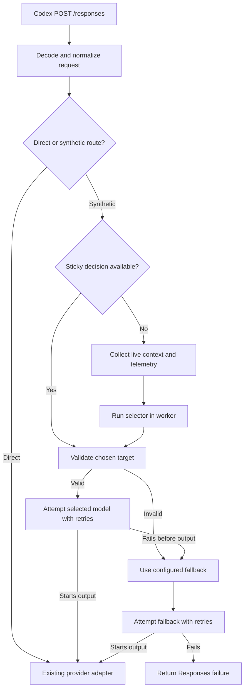

# Synthetic Model Routing

- Date: 2026-08-25
- Status: Approved for implementation after the server-state compatibility gate in this document
- Scope: Hydra-owned synthetic catalog models and the bundled Money Saver preset
- Non-code deliverable: This document specifies behavior; it does not implement it

## Summary

Hydra will support synthetic models: stable model entries owned by Hydra whose JavaScript selector chooses one direct underlying model for each routing decision. A synthetic model appears in Codex Desktop under a `hydra/` slug, but generation is performed by an existing OpenAI, Ollama, or LM Studio route.

The first bundled synthetic model will be `hydra/money-saver`. It will use a small LM Studio model to assign the request a complexity score from 1 through 3, then route generation as follows:

| Score | Generation model |
| --- | --- |
| 1 | `lmstudio/liquid/lfm2.5-1.2b` |
| 2 | `lmstudio/google/gemma-4-26b-a4b-qat` |
| 3 | `gpt-5.6-sol` |

`gpt-5.6-sol` is also the Money Saver fallback.

Synthetic models are configured in one Hydra-owned TOML file and point to arbitrary JavaScript modules. Selector code is trusted, unsandboxed local code. It may use Node.js, the filesystem, environment, network, subprocesses, dependencies, or any other capability available to the Hydra process. This is an intentional security tradeoff and must be prominently documented.

## Goals

1. Make a stable `hydra/...` model selectable in Codex Desktop.
2. Choose a direct underlying model with an arbitrary synchronous or asynchronous JavaScript function.
3. Support routing once per user turn or once per Codex session, selected per synthetic model.
4. Optionally keep tool-call continuations on the same underlying model.
5. Provide selectors with raw request data, normalized conversation data, request features, candidate capabilities and health, provider state, and local machine telemetry.
6. Advertise a conservative capability set shared by every effective candidate.
7. Fall back to one explicitly configured model whenever selection or the chosen target fails before downstream output begins.
8. Keep the chosen underlying model out of the synthetic catalog entry's visible identity while exposing routing decisions in debug logs and the menu bar.
9. Ship and install the Money Saver preset automatically.
10. Preserve Hydra's existing provider identity and its current OpenAI, Ollama, and LM Studio request adapters.

## Non-goals

The initial feature will not provide:

- Nested synthetic models.
- Ensembles, multi-model answering, or mid-request delegation.
- A selector helper that calls another model. A selector that wants a classifier must call it itself using ordinary JavaScript.
- Sandboxing or selector permission enforcement.
- A special privacy policy, privacy enforcement, prompt redaction, or derived-data controls.
- Cost accounting, budgets, or cost dashboards.
- Persistent routing state across Hydra restarts.
- Project-specific synthetic models.
- Weighted routing policy built into Hydra. A selector can implement randomness itself.
- Generalized failover across alternative models.
- More presets or examples beyond Money Saver.
- Log rotation in the initial release.
- A stable third-party selector API guarantee beyond the version described here.
- Response metadata that tells Codex which underlying model was selected.

## Terminology

- **Synthetic model**: A Hydra catalog model whose route invokes a selector before generation.
- **Requested synthetic model**: The `hydra/...` slug sent by Codex, such as `hydra/money-saver`.
- **Selector**: A JavaScript function that receives a selector context and returns, or resolves to, exactly one direct model slug.
- **Explicit candidate**: A direct model slug listed in `candidates`.
- **Fallback model**: The concrete direct model declared in `fallback_model`.
- **Effective candidates**: The union of explicit candidates and the fallback model. The fallback is implicitly allowlisted and does not need to be duplicated in `candidates`.
- **Selected model**: The valid direct model slug returned by the selector.
- **Ultimate model**: The model Hydra actually attempts to use after validation, retries, and any fallback.
- **Routing decision**: One selector invocation or one reuse of an in-memory sticky decision.
- **User turn**: An initial Responses request containing new user input plus any tool-call continuation requests associated with that input when tool stickiness is enabled.
- **Session**: Requests sharing the same `session-id` request header during one Hydra process lifetime.

## Architectural constraints

Synthetic routing must preserve the existing Hydra architecture:

- Codex Desktop remains configured with the built-in OpenAI provider identity.
- Installation continues to set only top-level `model_catalog_json` and `openai_base_url` in Codex's `~/.codex/config.toml`.
- Synthetic models are catalog entries and internal Hydra routes; they must not introduce `model_provider = "hydra"` or `[model_providers.hydra]`.
- A synthetic selector may return only an existing direct OpenAI, Ollama, or LM Studio catalog slug.
- The selected direct route must use the existing provider-specific request translation, tool handling, streaming, cancellation, and auth behavior.
- Existing request logging restrictions remain in force: prompt text, raw bodies, tool output, and model output must never be written to logs.

The runtime integration point is after Hydra has decoded and parsed the Responses body and found the requested route, but before it dispatches to `callOllama`, `callLMStudio`, or `forwardOpenAI`.



## Configuration

### File location

This feature uses exactly one Hydra-owned configuration file:

```text
~/.codex/hydra/config.toml
```

This is distinct from Codex's `~/.codex/config.toml`. Hydra must not load a directory of TOML fragments, clone portable configurations, or merge project-local synthetic definitions.

Hydra loads the file at startup and during `hydra refresh`. Configuration or selector changes take effect only after a successful refresh or restart.

### Definition schema

The normative shape is:

```toml
[synthetic_models.money-saver]
display_name = "Hydra: Money Saver"
description = "Routes requests by estimated task complexity."
selector = "selectors/money-saver.js"
candidates = [
  "lmstudio/liquid/lfm2.5-1.2b",
  "lmstudio/google/gemma-4-26b-a4b-qat",
]
fallback_model = "gpt-5.6-sol"
routing_scope = "user_turn"
sticky_tool_continuations = true
selector_timeout_ms = 0
retry_count = 2
retry_delay_ms = 1000
```

Fields:

| Field | Required | Meaning |
| --- | --- | --- |
| TOML table key | Yes | Unprefixed model name. Hydra exposes it with exactly one `hydra/` prefix. |
| `display_name` | No | Catalog label. Defaults to `Hydra: <table key>`. |
| `description` | No | Catalog description. |
| `selector` | Yes | JavaScript module path, resolved relative to `~/.codex/hydra/config.toml`. |
| `candidates` | Yes | Allowlisted direct model slugs the selector may return. May omit the fallback. |
| `fallback_model` | Yes | Concrete direct model used after selector or selected-model failure. Implicitly allowlisted. |
| `routing_scope` | Yes | `user_turn` or `conversation`. |
| `sticky_tool_continuations` | Yes | Whether follow-up tool result requests reuse the turn's underlying model. |
| `selector_timeout_ms` | No | Per-decision timeout. `0` or omission disables the timeout. Client cancellation always applies. |
| `retry_count` | No | Additional attempts for a failed target. Defaults to `2`. |
| `retry_delay_ms` | No | Abortable fixed delay between attempts. Defaults to `1000`. |

The table key may be written with or without a leading `hydra/`; Hydra normalizes it to exactly one prefix. Empty slugs and slugs in another provider namespace are invalid.

All candidate and fallback slugs must be direct routes. A `hydra/...` target is invalid in configuration or selector output. Synthetic nesting is prohibited.

### Validation and startup behavior

Hydra validates the complete TOML document before accepting it.

Fatal errors include:

- Invalid TOML syntax.
- Unknown or incorrectly typed required fields.
- Duplicate normalized synthetic slugs.
- Empty candidate lists.
- Invalid routing scope.
- Negative timeout, retry count, or retry delay.
- A candidate or fallback slug in the `hydra/` namespace.

On a fatal configuration error:

1. Hydra logs the error without prompt data.
2. `serve` refuses to start.
3. `refresh` exits nonzero.
4. A failed refresh does not overwrite the last valid generated catalog or route table.

A missing or unreadable selector module is handled differently: Hydra logs the affected definition and omits that synthetic model from the generated catalog. It does not make unrelated definitions unusable.

A currently unavailable candidate does not invalidate the definition. The synthetic model remains visible, candidate status is supplied to the selector, and a selection of that unavailable target follows normal retry and fallback behavior.

`refresh` verifies that each selector module file exists. It does not invoke the selector and does not make network calls on the selector's behalf.

### Installation

`hydra install` automatically installs the Money Saver definition and its JavaScript module under `~/.codex/hydra/`.

- A new installation creates `config.toml` and `selectors/money-saver.js`.
- Existing user configuration and selector files must not be overwritten.
- If the Money Saver definition is absent from a valid existing config, installation may add it while preserving all user definitions and formatting as safely as the TOML writer permits.
- Hydra does not provide a general clone/import workflow for external configurations.

## Catalog behavior

### Identity

Each valid definition contributes one catalog model:

- Slug: normalized `hydra/<name>`.
- Display name and description: from TOML or their defaults.
- Visibility: visible in the normal model list.
- Provider identity: remains compatible with Codex's built-in OpenAI provider bucket.

The catalog entry never changes its visible name to the selected underlying model. The underlying selection is observable only through Hydra's menu bar and debug log.

### Effective candidates

For validation and capability calculation:

```text
effective candidates = unique(candidates + fallback_model)
```

The fallback therefore:

- Is an allowed selector return value.
- Contributes to capability intersection.
- Does not need to appear explicitly in `candidates`.

### Capabilities

Except for reasoning and context size, a synthetic model advertises only capabilities shared by every effective candidate. This includes at least:

- Text and image modalities.
- Function/tool calling.
- Parallel tool calls.
- Search support.
- Any provider capability subsequently exposed by Hydra.

An unavailable candidate with no current capability metadata contributes the conservative value for optional capabilities. Hydra may use previously refreshed metadata if it remains available locally, but it must never infer a capability merely to keep it advertised.

Synthetic models expose a fixed logical reasoning set:

```text
light, medium, high
```

Where Codex or an upstream provider uses `low` rather than `light`, Hydra maps logical `light` to the compatible wire value `low`. The catalog representation must be verified against live Codex Desktop before implementation is considered complete.

The advertised context window is the maximum known context window among effective candidates. This is intentionally not an assertion that every candidate can accept every request. Runtime validation uses the estimated actual request size and the selected target's context window.

## Selector module contract

### Export and return value

A selector module exports one selector function. Hydra awaits its result, so synchronous and asynchronous functions are both valid:

```js
export default async function select(context) {
  return "gpt-5.6-sol";
}
```

The only valid resolved return value is a string containing one direct model slug from the effective candidate allowlist.

The following are selector errors:

- Throwing or rejecting.
- Timing out.
- Returning `null`, an object, an array, or any non-string value.
- Returning an empty or unknown slug.
- Returning a direct model outside the effective candidate allowlist.
- Returning any `hydra/...` slug.
- Returning a target that cannot satisfy a hard request capability or actual context requirement.

An invalid return value causes Hydra to restore the request's original reasoning effort and use the outer synthetic model's configured fallback.

Selectors do not return reason codes, confidence, user-facing explanations, request mutations, or generation parameters. In particular, the final simplified selector contract supersedes the earlier possibility of returning a reasoning-effort override.

### Execution model

- Selectors run off the main request loop in a Node.js worker thread.
- Hydra creates a fresh worker for each new routing decision, loads the approved selector module version, and does not preserve in-memory selector state between decisions.
- Startup or refresh registers the approved selector version used by later workers. Editing the source file does not promote a new version until another successful refresh or restart.
- Selector source/config changes become active only after refresh or restart.
- The worker is terminated when the client cancels, when Hydra shuts down, or when a configured selector timeout expires.
- A timeout of zero means no Hydra-imposed duration limit.
- Nested synthetic resolution is not supported.

Although Hydra treats selectors as stateless, arbitrary JavaScript can create external state itself. Hydra does not prevent or manage such state.

### Security model

Selector modules are fully trusted code with the same practical authority as Hydra:

- They may read and write files.
- They may read environment variables and credentials.
- They may access the network.
- They may import built-in and third-party modules.
- They may start subprocesses.
- They may terminate or destabilize their worker.

Package and relative import resolution is rooted in the selector module's directory according to normal Node.js ESM rules. Hydra does not restrict selector paths to a particular directory.

Hydra must display a security warning in user documentation near the configuration instructions. A worker thread is an isolation and responsiveness mechanism, not a security sandbox.

### No model-call helper

The selector context does not expose `generate()`, `callModel()`, or an equivalent model invocation API. If a selector wants to use an LLM classifier, it directly calls the desired server/API using ordinary JavaScript, then returns the chosen generation model slug.

Only the model returned by the selector performs the actual user-visible generation. Any calls made inside selector code are selector implementation details and are not routed, retried, or interpreted by Hydra.

## Selector context

Hydra supplies a fresh, read-only logical context. The exact JavaScript object names may evolve during implementation, but the version-one data contract must contain the following information.

```js
{
  version: 1,
  syntheticModel: "hydra/money-saver",
  source: "codex", // or "cli"
  signal: AbortSignal,

  raw: {}, // exact decoded Responses body; no request headers

  messages: {
    system: [],
    developer: [],
    history: [],
    latestUser: null,
    toolCalls: [],
    toolResults: [],
  },

  features: {
    approximateTokens: {
      total: 0,
      system: 0,
      developer: 0,
      history: 0,
      latestUser: 0,
      tools: 0,
    },
    actualContextTokens: 0,
    explicitFileCount: 0,
    imageCount: 0,
    hasImages: false,
    toolCount: 0,
    requestedReasoningEffort: "medium",
  },

  candidates: [
    {
      slug: "gpt-5.6-sol",
      fallback: true,
      provider: "openai",
      status: "available",
      contextWindow: 0,
      capabilities: {},
    },
  ],

  machine: {
    memory: {
      totalBytes: null,
      availableBytes: null,
      pressure: null,
    },
    battery: {
      percent: null,
      charging: null,
    },
    gpu: {
      devices: [],
      totalMemoryBytes: null,
      availableMemoryBytes: null,
    },
  },

  providers: {
    openai: {
      status: "available",
      models: {},
    },
    ollama: {
      status: "available",
      queueDepth: null,
      models: {},
    },
    lmstudio: {
      status: "available",
      loadedModels: [],
      models: {},
    },
  },
}
```

`signal` is local to the worker and is aborted when the downstream request is cancelled or the configured selector timeout expires. Selectors should pass it to their own cancellable I/O, such as `fetch`. Hydra may terminate the worker after signalling cancellation so selector cooperation is not required for request cleanup.

### Normalized messages

Hydra must keep these categories distinct:

- System instructions.
- Developer instructions.
- Earlier user/assistant history.
- The most recent user message.
- Tool calls.
- Tool results.

All content available in the decoded request is available both in the normalized representation and through `raw`. Request headers, including authorization and session identifiers, are not exposed to selector code through the context.

### Request features

The token estimator is provider-independent and deliberately biased toward overestimation. It reports a total estimate and category-level estimates. `actualContextTokens` means Hydra's conservative estimate of the context that will be sent to the selected generation model; it is not the catalog's maximum context window.

File count includes only explicitly structured file or attachment inputs Hydra can identify. Hydra does not parse arbitrary prompt prose to guess whether it describes or embeds a file.

`toolCount` is the total requested tool count. Version one does not need separate counts for Desktop, app-server, hosted, or custom tools.

### Live status and telemetry

Candidate/provider status and machine telemetry are measured live for every routing decision, not taken solely from the last catalog refresh.

Required best-effort telemetry includes:

- Total and available RAM.
- Memory pressure.
- Battery percentage and charging state.
- GPU identity.
- Total and available GPU memory.
- OpenAI/cloud reachability or auth status when it can be checked without a user generation.
- Ollama responsiveness, model status, and queue/activity depth when exposed.
- LM Studio responsiveness, model status, and currently loaded models.

Unsupported, unavailable, or prohibitively invasive measurements are represented as `null`, an empty collection, or an explicit `unknown` status. Telemetry collection must honor request cancellation. A telemetry probe failure does not itself cause fallback; it is data for the selector.

## Routing scope and in-memory state

### Session identity

Hydra uses the `session-id` request header as the session key. State is held only in memory.

- If `session-id` is absent, Hydra cannot apply conversation-scoped reuse and evaluates the selector for each independent request.
- All routing state is cleared on Hydra restart.
- A successful `hydra refresh` clears all routing state.
- No routing state file is written.

### `user_turn` scope

With `routing_scope = "user_turn"`, Hydra invokes the selector for every new user turn.

If `sticky_tool_continuations = true`, tool-call output requests belonging to that turn reuse the exact underlying model and effective reasoning effort selected for the initial request. The turn lock clears after the model produces a final response rather than a tool call.

If `sticky_tool_continuations = false`, every Responses POST, including tool-output continuations, may invoke the selector and move to another model or provider.

### `conversation` scope

With `routing_scope = "conversation"`, the first successful route locks the session to the exact underlying model and effective reasoning effort. Subsequent requests reuse both without running the selector. Tool-stickiness configuration has no additional effect while the conversation lock exists.

If the initially selected model fails and fallback successfully begins the response, the fallback becomes the locked model. The lock lasts until refresh, restart, or the session ends outside Hydra's observable lifetime.

### Server-side response state compatibility gate

The implementation must not assume that OpenAI Responses server-side state is either required or disposable. This must be tested before synthetic model work chooses a locking strategy.

Existing summarized Hydra logs inspected while writing this specification contained `store` and `prompt_cache_key` fields but no observed `previous_response_id`. This is useful evidence but not conclusive.

The compatibility experiment must:

1. Capture protocol metadata only; never log prompts or outputs.
2. Determine whether Codex Desktop sends `previous_response_id` or another response-state reference in ordinary chats and tool continuations.
3. Determine whether changing the exact cloud model or changing from cloud to local while that reference is present causes an error, loses necessary history, duplicates context, or otherwise breaks the user experience.
4. Determine whether the state reference is required for correctness or only improves caching/efficiency.
5. Exercise non-streaming and streaming responses as applicable.

Decision after the experiment:

- If discarding or crossing server state does not break correctness, Hydra ignores it for synthetic locking and does not add special state behavior.
- If crossing it breaks correctness, Hydra parses the minimum JSON/SSE metadata required to associate response state with the exact underlying model, without changing response content. A later request carrying `previous_response_id` reuses that exact model and creates an exact-model lock for that `session-id`.
- A required server-state lock overrides the synthetic model's normal reevaluation policy for the remainder of that in-memory session.
- If the behavior cannot be established reliably, implementation must default to correctness: retain the exact model once an observed state reference is in use.

This experiment and recorded decision are an implementation gate, not an invitation to add broader state management.

## Selection and validation

For a routing decision without a reusable lock, Hydra performs these steps:

1. Load the already validated synthetic definition snapshot.
2. Normalize the request and conservatively estimate its actual context size.
3. Probe live candidate, provider, and machine state.
4. Start the selector worker with the configured timeout and request cancellation.
5. Validate that the returned value is one direct effective-candidate slug.
6. Validate the selected model against the actual request:
   - The actual estimated context fits its current context window.
   - It supports image input when images are present.
   - It supports required tool calling when tools are required.
   - It supports any other hard request capability Hydra can determine.
7. Normalize reasoning effort for the selected model.
8. Attempt generation using the selected direct route.

If steps 4 through 7 fail, Hydra does not ask the selector for another choice. It immediately moves to the configured fallback with the original requested reasoning effort.

### Reasoning normalization

The selector sees the requested reasoning effort but cannot change it directly.

Hydra preserves the requested effort when supported. If a selected model supports fewer reasoning levels, Hydra may reduce the request to the greatest supported effort no higher than the request. Logical `light` maps to a provider's compatible low-effort value. Hydra must not silently increase reasoning effort.

If selector output itself is invalid, fallback starts from the original requested effort rather than any partially normalized value.

### Context overflow

Candidate context windows are exposed to the selector. Selecting a model whose context window is smaller than `actualContextTokens` is a selector error and uses fallback. An upstream context-length rejection also counts as a selected-model failure and uses fallback after the selected model's retries.

If fallback cannot satisfy the actual context or another hard capability, Hydra fails the generation rather than invoking an incapable fallback.

## Retry, fallback, streaming, and errors

### Retry policy

`retry_count` is the number of additional attempts after the initial attempt. The default of `2` therefore permits three total attempts per target.

Hydra retries the same target only. It waits the configured fixed `retry_delay_ms` between attempts. The delay is cancellable.

Every failure before downstream response bytes are emitted is retryable for purposes of this policy, including:

- Network errors.
- Timeouts.
- Authentication failures.
- Any non-success HTTP status.
- Malformed initial upstream responses.
- Context-length rejection.
- Provider unavailability.

Hydra does not categorize errors to optimize away attempts. If selected and fallback happen to be the same slug, the ordinary selected-target and fallback phases still apply.

The retry policy applies to the selected model and then to the fallback model. If fallback exhausts its attempts, Hydra reports failure to Codex.

### Fallback

Fallback occurs when:

- Selector execution fails.
- Selector output is invalid.
- The selected target is outside the allowlist.
- The selected target lacks a hard capability.
- The actual context does not fit the target.
- The selected target exhausts retries before response output begins.

Fallback always uses the outer requested synthetic model's `fallback_model`; there is no nesting and no intermediate fallback chain. Hydra preserves the original request reasoning effort, subject only to target-compatible downward normalization.

Fallback is not generalized failover. Hydra never chooses an unrequested alternate candidate on its own.

### Streaming boundary

Hydra delays downstream SSE headers and response events until it has received and validated the first usable upstream event. This preserves the ability to retry or use fallback before visible output begins.

Once any downstream response bytes have been emitted:

- Hydra never changes models.
- Hydra never reconnects in a way that could duplicate output.
- An unrecoverable upstream error is translated to the most appropriate Responses error event available and the stream is closed cleanly.
- Normal request cancellation remains a non-error cancellation outcome.

## Money Saver preset

### Definition

Money Saver is installed automatically with:

- Synthetic slug: `hydra/money-saver`.
- Routing scope: `user_turn`.
- Sticky tool continuations: enabled.
- Fallback: `gpt-5.6-sol`.
- Retry count: 2.
- Retry delay: 1000 ms.
- Selector timeout: disabled unless the installed config is edited.

Effective candidates:

1. `lmstudio/liquid/lfm2.5-1.2b`
2. `lmstudio/google/gemma-4-26b-a4b-qat`
3. `gpt-5.6-sol` as the implicit fallback candidate

### Classifier behavior

The selector itself calls LM Studio's OpenAI-compatible endpoint using `lmstudio/liquid/lfm2.5-1.2b`. Hydra does not perform this classifier call and does not provide a model-call helper.

The classifier request:

- Disables thinking/reasoning.
- Requests one numeric score: `1`, `2`, or `3`.
- Uses deterministic settings where supported.
- Supplies the classifier with all relevant normalized request information, including the separated instruction/message categories, actual token estimate, explicit files, images, tools, requested reasoning effort, candidate capabilities/context windows/status, provider status, and machine telemetry.
- Instructs the classifier to consider the complete request itself rather than relying on hard-coded Hydra rules for images, context, tools, coding, or reasoning.

Score mapping is fixed:

```text
1 -> lmstudio/liquid/lfm2.5-1.2b
2 -> lmstudio/google/gemma-4-26b-a4b-qat
3 -> gpt-5.6-sol
```

Hydra adds no pre-classifier complexity heuristics. Target capability and actual-context validation still applies after the selector returns because that is a generic routing invariant, not Money Saver policy.

If the classifier is unavailable, returns anything other than exactly one valid score, or the selector otherwise errors, Hydra uses `gpt-5.6-sol`.

## Debug logging

### CLI flag

The canonical flag becomes:

```text
--debug
```

It replaces the user-facing `--debug-auth` name. Debug output continues to use the single file:

```text
~/.codex/hydra/hydra.log
```

Synthetic routing events are written whenever `--debug` is enabled. They are not written during normal non-debug operation. Log rotation is deferred.

### Required routing metadata

Debug routing records include, when applicable:

- Timestamp and event type.
- `source`: `codex` or `cli`.
- Requested synthetic slug.
- Routing scope and whether a sticky decision was reused.
- Selected slug and ultimate slug.
- Whether fallback occurred.
- Requested and effective reasoning effort.
- Approximate total and category token counts.
- Actual context estimate.
- Explicit file count, image count, and tool count.
- Candidate capabilities, context windows, and live statuses.
- Provider status and available telemetry.
- Selector module identity/version, duration, timeout, cancellation, and error metadata.
- Attempt number, retry delay, upstream provider/status, and fallback phase.
- The final success, failure, or client-cancelled outcome.

The log must never include:

- Prompt or instruction text.
- Raw or normalized message bodies.
- Raw Responses bodies.
- Tool arguments or results.
- Model/classifier output.
- Authorization values, cookies, account identifiers, or session identifiers.
- Local generated output.

The Money Saver classifier's raw numeric output is still local model output and must not be logged. The selected target captures the useful routing outcome without recording classifier output. Selector-provided error messages and stack traces must also be sanitized so a selector cannot accidentally place prompt text in the log.

## Menu bar

The menu bar adds a top-level `Synthetic Models` submenu. Each active synthetic model receives a nested submenu showing:

- Synthetic slug and display name.
- Selector module path.
- Explicit candidates.
- Fallback model.
- Routing scope.
- Tool-continuation stickiness.
- Selector timeout.
- Retry count and delay.
- Current validation status.
- Current candidate/provider status where available.
- Last selected and ultimate model in memory.

It does not show cost estimates, savings, token totals, selection counts, or historical analytics.

The synthetic menu provides two actions:

- **Refresh**: runs the equivalent of `hydra refresh`, updates the catalog/config snapshot, clears routing locks and last-selection state, and refreshes the displayed menu state.
- **Open Config**: opens `~/.codex/hydra/config.toml` in the system-associated editor.

Last selection is memory-only and resets on restart or refresh. Models omitted because their selector file is missing do not appear as usable synthetic models; the debug log records why they were omitted.

## Route inspection CLI

The command is:

```text
hydra route <synthetic-model> [options]
```

It invokes the running Hydra server and performs a real routing decision without performing the final generation. For Money Saver, this means the selector really calls its LM Studio classifier. The command prints the validated target slug, or the configured fallback if selection fails and fallback validation succeeds. Otherwise it exits nonzero with a non-content error.

Supported inputs:

- Inline text.
- Standard input.
- One or more files when the CLI can represent them as structured input.
- One or more images.
- Requested reasoning effort.

The command does not stream because it produces no model generation. It must not create or modify conversation locks. Debug events set `source = "cli"`.

The server should expose a localhost-only control endpoint for this operation rather than sending a normal `/responses` request that could accidentally invoke generation. The endpoint validates that the requested slug is synthetic and returns routing metadata sufficient for the CLI to print the final target; it never returns prompt content.

## Error reporting

User-facing failures returned to Codex should identify the phase without exposing selector source, prompts, secrets, or raw upstream bodies. Useful categories include:

- Synthetic configuration invalid.
- Selector unavailable.
- Selector failed or timed out.
- Selector returned an invalid target.
- Selected model did not satisfy request capabilities/context.
- Selected model exhausted retries.
- Fallback did not satisfy request capabilities/context.
- Fallback exhausted retries.
- Stream failed after output began.

Module paths, sanitized error codes/stages, candidate status, retry records, and telemetry belong only in `hydra.log` under `--debug`. Selector-provided error strings and stack traces must not be recorded verbatim because arbitrary selector code may include request content in them.

## Generated state

The generated route table may represent a synthetic entry as conceptually equivalent to:

```json
{
  "hydra/money-saver": {
    "provider": "synthetic",
    "selector": "selectors/money-saver.js",
    "candidates": [
      "lmstudio/liquid/lfm2.5-1.2b",
      "lmstudio/google/gemma-4-26b-a4b-qat"
    ],
    "fallbackModel": "gpt-5.6-sol",
    "routingScope": "user_turn",
    "stickyToolContinuations": true,
    "selectorTimeoutMs": 0,
    "retryCount": 2,
    "retryDelayMs": 1000
  }
}
```

The exact generated schema is an implementation detail, but it must contain enough validated, immutable information for `serve` to route without reparsing TOML per request. Selector/config updates are promoted into this runtime snapshot only by successful refresh or restart.

All generated files remain under `~/.codex/hydra/`. Existing Codex backup and restore behavior is unchanged.

## Verification plan

### Unit tests

Add tests for:

- TOML parsing and schema validation.
- `hydra/` slug normalization.
- Effective candidate construction with implicit fallback.
- Rejection of synthetic candidates and synthetic selector results.
- Fatal config errors versus nonfatal missing selector modules.
- Catalog omission for missing selectors.
- Visibility retention for temporarily unavailable candidates.
- Conservative capability intersection.
- Maximum advertised context window.
- Static logical reasoning levels and `light`/`low` wire mapping.
- Provider-independent, overestimating token calculation.
- Message category separation.
- Structured file/image/tool feature detection.
- Worker success, exception, invalid return, timeout, and cancellation.
- Per-turn selection and tool-continuation stickiness.
- Per-conversation locking by `session-id`.
- State clearing on refresh and restart.
- Target capability/context validation.
- Same-target retries and abortable fixed delay.
- Fallback after every pre-output failure class.
- Failure after fallback exhaustion.
- Delayed downstream stream commitment.
- Responses error after post-output failure.
- Absence of prompts, raw bodies, outputs, and secrets from debug logs.
- CLI `source` metadata.

### Money Saver tests

Using a fake LM Studio classifier endpoint, verify:

- Classifier thinking is disabled.
- Every score maps to the required model.
- Classifier sees all required normalized feature categories.
- No Hydra hard-coded complexity rule overrides the score.
- Invalid score, malformed output, timeout, or classifier failure uses `gpt-5.6-sol`.
- Selected target is logged without the classifier score, prompt, or output.

### Menu and CLI tests

Verify:

- Synthetic configuration appears in nested menu items.
- Last selection updates in memory.
- Refresh clears locks and last selection.
- Open Config targets the Hydra-owned TOML path.
- `hydra route` invokes the running server, accepts supported inputs, prints only the target, performs no final generation, and does not mutate session state.

### Live Desktop verification

In addition to Hydra's existing cloud, Ollama, and LM Studio checks:

1. Complete and record the server-state compatibility experiment.
2. Install the Money Saver preset and refresh the catalog.
3. Confirm `hydra/money-saver` appears without exposing its current target in the model selector.
4. Route known score-1, score-2, and score-3 classifier fixtures.
5. Confirm generation uses the corresponding provider adapter.
6. Verify user-turn reselection and conversation locking in separate synthetic definitions.
7. Verify both tool-continuation stickiness settings.
8. Stop a selected local provider and confirm retries followed by cloud fallback before output.
9. Force a failure after output begins and confirm a Responses error without model switching.
10. Confirm the menu bar and debug log show the ultimate model while Codex retains the synthetic selection.

## Acceptance criteria

The feature is complete when:

1. A user can define valid global synthetic models in `~/.codex/hydra/config.toml` using JavaScript selector paths.
2. Valid definitions appear as `hydra/...` entries without altering Codex's built-in provider identity.
3. Selector output is restricted to one direct effective-candidate slug.
4. Nested synthetic routing is rejected.
5. Every required selector context field is populated or explicitly unknown using live measurements.
6. Turn and conversation scopes behave as specified using in-memory `session-id` state.
7. Tool-continuation stickiness is configurable and verified.
8. Selected-model retry and concrete fallback behavior work before stream commitment.
9. No model switch occurs after downstream output begins.
10. Capabilities are conservatively advertised, context is maximized in the catalog, and actual request fit is checked at runtime.
11. Money Saver is installed automatically and maps classifier scores to the three required models.
12. The menu bar shows synthetic configuration and last routing state and provides Refresh and Open Config actions.
13. `hydra route` performs selector evaluation through the running server and prints the target without generating an answer.
14. `--debug` records complete non-content routing diagnostics in `hydra.log` and does not leak prohibited data.
15. The server-state compatibility decision is documented with live evidence and its required locking behavior is tested.
16. All existing tests and the repository's prescribed syntax checks pass.

## Deferred extensions

The design leaves room for later work without including it now:

- Persistent budgets and cost-aware state.
- Privacy-oriented selectors.
- Additional bundled presets.
- Selector SDK/versioning.
- Sandboxed selectors.
- Project-scoped configuration.
- Analytics derived from debug routing events.
- Log rotation.
- Model ensembles or multi-stage generation.
- Carefully bounded synthetic composition, if ever justified.
